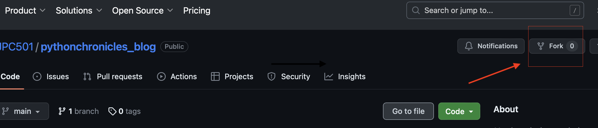

## PYTHONCHRONICLES BLOG

**python chronicles** es un blog creado para que los usuarios y amantes de python, puedan compartir trucos y consejos sobre cómo escribir código en python. Cualquier persona es bienvenida a contribuir, aqui la forma de como contribuir en el desarrollo:

# Configuracion inicial:

1. Cree un fork del proyecto haciendo click en el boton encerraro en rojo

2. Clona el fork del repositorio que acabas de crear:
   git clone git@github.com:<Tu-user>/pythonchronicles_blog.git

3. ingresa a la carpeta que git creo en tu computadora:
   cd pythonchronicles_blog

4. Cree un entorno virtual y activelo:
   python -m venv env
   source env/bin/activate # macOS y Linux
   env\Scripts\activate.bat # Windows

5. Instale las dependencias del proyecto:
   pip install -r requirements.txt

# Frontend

Este proiyecto usa tailwind css por lo que debera instalarlo, o puede usar el CDN de tailwind:

**Instalación de Node.js y Tailwind**:

Asegúrate de tener Node.js instalado en tu máquina. Si no lo tienes, puedes descargarlo e instalarlo desde [Node.js official website](https://nodejs.org/).

Una vez que tengas Node.js, instala Tailwind CSS con:

npm install tailwindcss

**Tailwind CDN**:

https://tailwindcss.com/docs/installation/play-cdn

# Tabajando en el proyecto:

1. crea una rama para realizar tus aportes:

   git checkout -b mi-rama-royecto

2. levanta el servidor:

   python run.py

3. a codear

Gracias por tus aportes.
